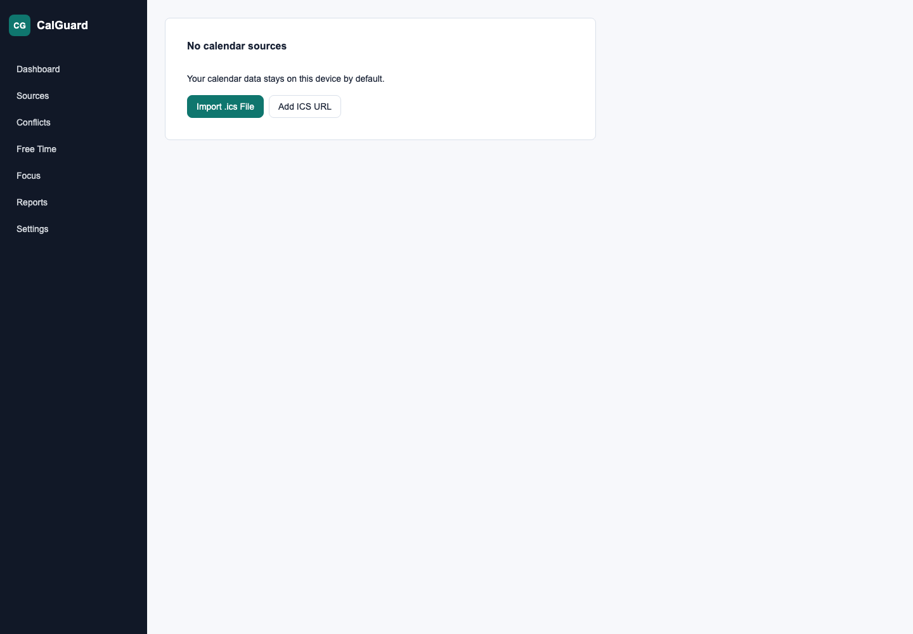

# CalGuard

A local-first calendar health analyzer built with Rust, Tauri, Next.js and React.

CalGuard imports local `.ics` files or remote ICS URLs, analyzes them locally,
and explains conflicts, focus-time gaps, overloaded days, and calendar health.



## Core Features

- Local-first calendar analysis
- Built with Rust, Tauri, Next.js and React
- Import local `.ics` files
- Subscribe to remote ICS URLs
- Detect meeting conflicts
- Find deep work blocks
- Identify overloaded days
- Generate calendar health scores
- Export Markdown and JSON reports
- Privacy-first report mode

## Non-goals

CalGuard is not a full calendar client.
It does not modify your calendar.
It does not upload your events to a cloud service.
It does not require an account.

## Architecture

```text
Next.js + React static export -> Tauri v2 shell -> Rust commands -> SQLite/local files/remote ICS fetch
```

The desktop frontend is a static Next.js export. File access, SQLite storage,
remote ICS fetching, parsing, recurrence expansion, scoring, and report export
are implemented in Rust.

## Development

```bash
pnpm install
pnpm --filter @calguard/desktop dev
```

Rust core tests:

```bash
cargo test --workspace
```

Full local verification:

```bash
cargo fmt --all --check
cargo clippy --workspace --all-targets -- -D warnings
cargo test --workspace
pnpm --filter @calguard/desktop lint
pnpm --filter @calguard/desktop test
pnpm --filter @calguard/desktop build
pnpm --filter @calguard/desktop exec tauri build --bundles dmg --ci --no-sign
```

Desktop development:

```bash
pnpm --filter @calguard/desktop tauri:dev
```

## Fixtures

The `fixtures/` directory contains representative ICS files for parser,
recurrence, conflict, transparency, all-day, timezone, malformed input, and
focus-time scenarios.

## Packaging

Platform bundle targets are configured for:

- macOS: `.app` and `.dmg`
- Windows: NSIS installer
- Linux: deb package

GitHub Actions runs Rust/frontend verification and bundle smoke tests. The
release workflow builds platform artifacts and creates a draft GitHub Release
when a `v*` tag is pushed.

Release candidates should be checked against `docs/RELEASE_QA.md` before the
draft release is published.
